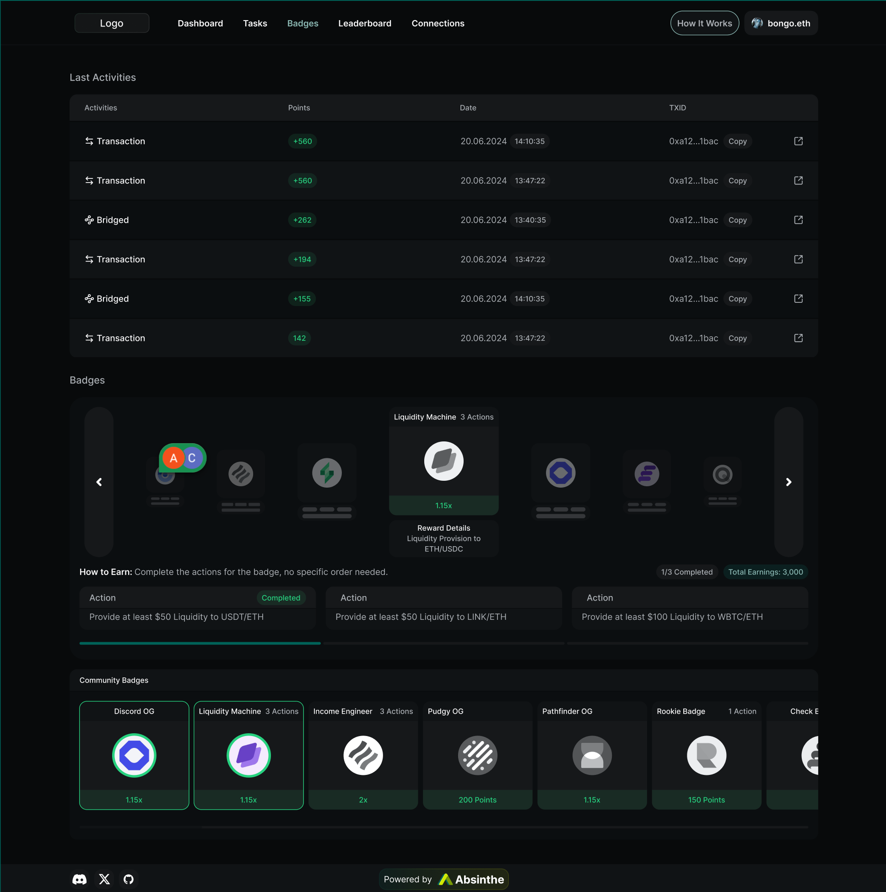

# Absinthe Technical Assessment 

## Overview
Congrats on making it to the technical assessment!
This is a fully self-contained fullstack project with a Hasura GraphQL backend, a Node.js Express server, a Postgres DB, and a Nextjs + RadixUI frontend.

As a reminder, here are a few things we’re paying special attention to when looking for the newest joining member of the Absinthe team!
1. Pixel-Perfect and responsive implementation of the Figma designs
2. CSS Mastery (advanced control of flexbox, animations, positioning, etc), knowledge of tailwind AND raw css, and good design intuition
3. Effortless use of RESTful and GQL APIs
4. 5+ YoE and ability to make informed+opinionated technical design decisions

## Timeline
You have 3 days to complete this task from the time you receive the assignment.

## Instructions
Using NextJS 14 and Radix UI (alongside Tailwind CSS), you will be implementing the:
1. Badges Section
2. Last Activities Section

You can find the [figma reference here](https://www.figma.com/design/8ZSGcdV5SUpgqY8EfeMasn/Test-Task---Absinthe?node-id=84-566&m=dev&t=SuZxx4NMKMTmrJhC-1).
Once you get to the file, you should request access from us which will automatically grant you 3 days of figma-dev access to the file.



The frontend dir is purposefully not scaffolded. You will need to create this yourself.

### Badges Section
You will be responsible for creating the:
1. Badge Carousel
2. How To Earn Section
3. Community Badge Section

#### Requirements
The badges are not being dynamically pulled as of yet, so you can hardcode the data for all the badges for now.
This includes downloading the images from the figma for the badges.

The carousel should be navigated by either clicking the buttons on the side, by clicking on the badge in the carousel, or by swiping.

If a badge in the community badges section is clicked, then the carousel should spin and snap to that selected badge.  

If a user holds a badge, then that badge should be highlighted with a border.

The navbar + footer don't necessarily need to have correct linking, but you should implement the design as closely as possible.

### Last Activities Section
You will be using the Hasura GraphQL API to fetch the data for the badges and last activities sections.
This should be a live updating field, so you will need to use the subscription API to get the latest data.
You should also think about any CSS animations that would improve the user experience of when the data is updated.

The container already includes a cron job that pushes updates to the `logs` table every 1 minute with a random user and a random action.

Feel free to modify the Hasura tables or any part of the codebase. It is simply a starting point for you to build upon, and all parts of the assignment
are expected to be hacked on. Nothing is set in stone and nothing is off limits.

For the `points` column in the figma, feel free to use one of the amounts of the `decoded` column in the postgres db for this.
The exercise is more to see you have good control over graphql subscriptions and design implementation, rather than absolute correctness of the data.


## ENV Setup
You will need to create a `.env` file in the root directory of the project and add the following environment variables.
You can use openssl to generate the secret.
```env
HASURA_GRAPHQL_ADMIN_SECRET="<your-hasura-admin-secret>"
EXPRESS_API_URL="http://express-server:3000"
```
The Postgres connection string is already set in the docker-compose for sake of the exercise.
Obviously, in a production environment, you would want to use a more secure method of storing the connection string.

## Hasura Setup
You will need to download the `hasura-cli` from [here](https://hasura.io/docs/1.0/graphql/manual/hasura-cli/install-hasura-cli.html#install-hasura-cli) if you haven't already.

Once you can see the console, apply the migrations + the reload the metadata by running this command from the `hasura` directory:
```bash
hasura metadata apply --envfile ../.env; hasura migrate apply --envfile ../.env; hasura metadata reload --envfile ../.env
```

You can run the hasura console by going into the `hasura` directory and running:
```bash
hasura console --envfile ../.env
```

